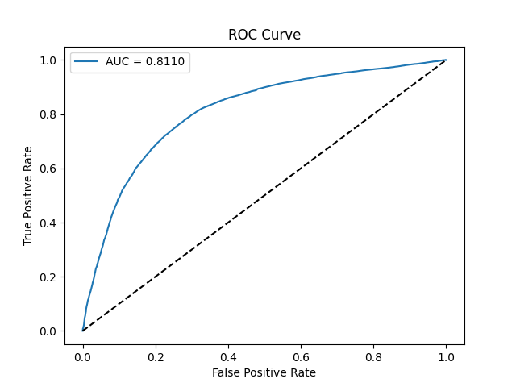
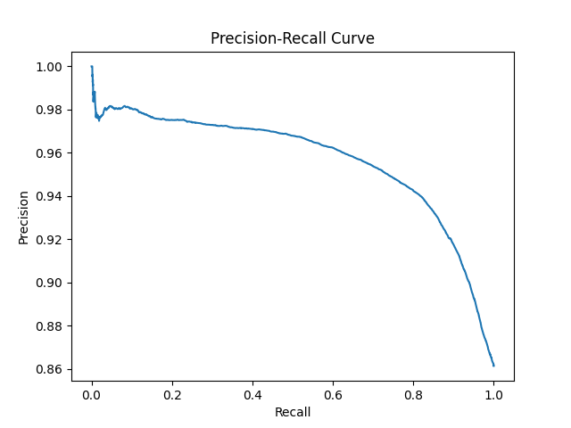

# 🧪 Protein-Molecule Binding Prediction

This project uses a multimodal deep learning model to predict protein–molecule interactions using protein sequences, molecule SMILES, and textual descriptions.

## 📁 Dataset

- Source: BindingDB + UniProt
- Dataset link: https://drive.google.com/drive/folders/14KFBOEsA-czigF2_98avY2-qi8WGS-9v?usp=sharing 
- Size:
  - Training samples: `964,884`
  - Validation samples: `120,000`
  - Test samples: 107,098

## 🧠 Model Architecture

- Three encoders (frozen):
  - Protein: ESM2 (e.g., esm2_t6_8M_UR50D)
  - Molecule: ChemBERTa
  - Description: BioBERT
- Fusion: concatenation → Linear → ReLU → Dropout → Linear
- Loss: Binary Cross Entropy **with class weights** (because the datset is heavily labeled "1")
- Optimization: Adam with gradient accumulation
- Mixed precision training enabled

## 📊 Evaluation Metrics

| Threshold | Accuracy | F1 (Class 0) | F1 (Class 1) | Macro F1 | Weighted F1 | AUC |
|-----------|----------|--------------|--------------|----------|-------------|------|
| **0.5**   | 0.7558   | 0.4562       | 0.8425       | 0.6494   | 0.7890      | 0.8129 |
| **0.4**   | 0.8100   | 0.4839       | 0.8836       | 0.6837   | 0.8282      |        |
| **0.3**   | 0.8383   | 0.4722       | 0.9045       | 0.6884   | 0.8446      |        |

## 📈 Visualizations

All plots are saved under `/plots/`:

- [x] Histogram of predicted probabilities
- [x] ROC Curve
- [x] Precision–Recall Curve
- [x] Confusion Matrix

## 🛠 Training Info

- Trained on Google Colab (T4 / A100)
- Epochs: 3
- Batch size: 32–64 with accumulation
- Checkpoints every 5000 steps with resume support

## 📎 Files

- `test_with_predictions.csv`: includes predicted probability and ground truth
- `checkpoints/`: saved models
- `README.md`: project overview

## 🔮 Future Work

- Unfreeze transformer layers for fine-tuning
- Try attention-based fusion
- Evaluate on external datasets

---

## 💡 Citation

If you use this work, please consider citing or referencing it in your own projects. This model aims to support downstream tasks in drug discovery.
